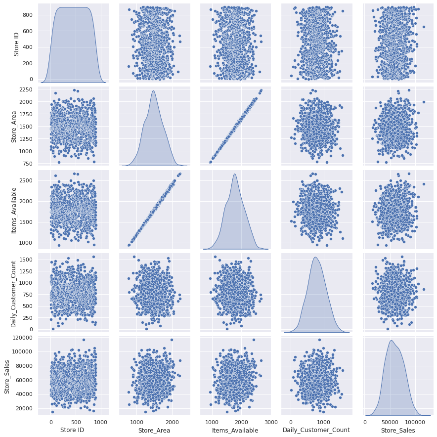
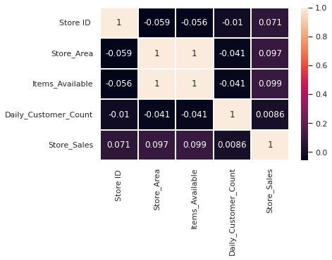
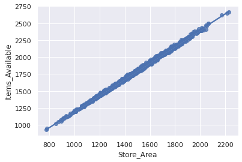
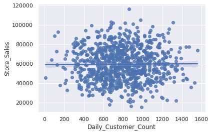

# DS5220-Final-Project

# Intro
The purpose of this repository is to contain the results of my DS5220 final project.  The instructions for this project can be found in the Project Guidlines folder.  The publicily available dataset used in this exploratory data analysis, [Supermarket store branches sales analysis](https://www.kaggle.com/datasets/surajjha101/stores-area-and-sales-data), can be found on [kaggle](https://www.kaggle.com/).

The goals for our exploratory data analysis (EDA) involve gaining insight into the supermarket, a
self-service  shop  that  is  ubiquitous  in  American  culture.    The  supermarkets  and  grocery  stores  industry accounts for the largest food retail channel in the United States, making the applications of answers to any of the following questions posed in our EDA essential and possibly profitable insights. 

# Exploring the Data

First we visualize the first five rows of the data to understand the features.
```
	Store ID	Store_Area	Items_Available	Daily_Customer_Count	Store_Sales
0	       1	      1659	           1961	                 530	      66490
1	       2	      1461	           1752	                 210	      39820
2	       3	      1340	           1609	                 720	      54010
3	       4	      1451	           1748	                 620	      53730
4	       5	      1770	           2111	                 450	      46620
```

Next we find out if there are any empty cells in the dataset.

```
Store ID                0
Store_Area              0
Items_Available         0
Daily_Customer_Count    0
Store_Sales             0
dtype: int64
```

Next we create a pairs plot (below) to understand the data struture.  The diagonal plots show us that the variables are normally distibuted and centrally concentrated. It is possible to use clustering analysis here with Store Area, Items Available, Daily Customer Count, and Store Sales.  There is also a visible linear relationship between Store Area and Items available.  It is possible to fit a linear model here.



```
python src/src1.py
```

Next we create a heatmap (below) to further visualize the correlation of various features.  The heatmap also confirms that Store Area is correlated to Items available.



```
python src/src2.py
```

# Fitting and Assessing Models - Store Area on Items Available

The first question we wanted answered in our project proposal was "Does the store area have an influence on the items available?".

Since we identified a possible relationship between Store Area and Items Available, we fit a linear regression model.  We then assessed the model fit by calculating the R squared score * 100 (99.75369279818469) which told us that the model explains 99% of the data which is to be expected.  We then calculated the absolute error (11.944631101516526) which helped confirm that our model is well explained and holds.

```
python src/src3.py
```

The fit of the regression line of the model is represented in the figure (below).  The model confirms that an increase in Store Area leads to increase in Items Available and vice versa.



```
python src/src4.py
```

# Fitting and Assessing Models - Daily Customer Count on Store Sales

The second question we wanted answered in our project prosal was "Does the daily customer count have an influence on the store sales?"

There was no visible linear relationship between Daily Customer Count and Store Sales, so we do not expect a linear model to hold.  We fit a linear regression model and then assessed the model fit by calculating the R squared score * 100 (-0.6291680857297921) which told us the model did not explain the data, possibly due to underfitting.  We then calculated the absolute error (13318.772007845078) which was very high and helped confirm that our model fails.

```
python src/src5.py
```

The fit of the regression line of the model is represented in the figure (below).  The model fails and does not answer the question or represent a linear relationship between the variables.



```
python src/src6.py
```

# Fitting and Assessing Models - Store Aarea & Items Available on Daily Customer Count

The third question we wanted answered in our project prosal was "Does the store area and the items available have an influence on daily customer count?"

We fit a multiple regression model and then assessed the model fit by calculating the R squared score * 100 (-0.5234428168892302) which told us the model did not explain the data, possibly due to underfitting.  We then calculated the absolute error (240.74622374473486) which was very high and helped confirm that our model fails.

```
python src/src7.py
```

# Fitting and Assessing Models - Daily Customer Count & Items Available on Store Sales

The last question we wanted answered in our project prosal was "Does the daily customer count and the items available have an influence on store sales?"

We fit a multiple regression model and then assessed the model fit by calculating the R squared score * 100 (-0.6291680857297921) which told us the model did not explain the data, possibly due to underfitting.  We then calculated the absolute error (13318.772007845078) which was very high and helped confirm that our model fails.

```
python src/src8.py
```
